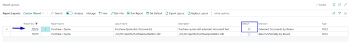
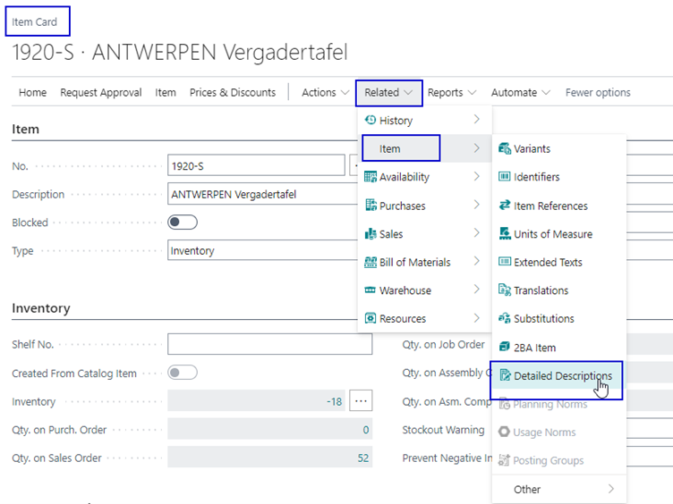

# Manual Extended Documents

Do you want additional information on you Purchase, sales and jobs documents, with this extension you can make this possible by creating addition text in HTML that is shown on these documents.

##### Key Features
*	Add text in HTML on documents
*	Add additional information on an item which is used on documents.

## Extended Documents Setup

### Report Layotu Settings
To set the Extended Document Text as the default report layout for the specific reports go to the Report Layout page and select the required Report ID layout.

1.	Choose the search icon, enter Report Layouts and choose the related link.
2.	On the Report Layouts page select the required Report ID layout and select the action Set Default from the menu.

### Extended Document Texts
On the page Ext. Document Texts it is possible to create extended text on various documents.
The following documents are supported.
*	Purchase Quotes
*	Purchase Orders
*	Sales Quotes
*	Sales Orders
*	Job Quotes

The extended text can be set for two type of text namely a header and a footer, which can be made in different languages. Based on a starting ending date the extended document text will be assigned to the document.
The header text will appear above the section where the product/ service sold is shown and the footer part will below the Ship-to address.

### Extended Documents Text on an item
Also on the item card is a possibility to place a detailed description.
Go via the menu on the item card Related > Item > Detailed Descriptions to the **Text Editor** where you can add your additional product information.

### Example of a document with ext. document text
Below an example of a Purchase Quote with extended document text. The header text will appear above the section where the product/ service sold is shown and the footer part will below the Ship-to address. The detailed description on the item is shown directly below the item.

When creating a purchase order document from the quote the extended document text is also copied to the order document.

### Permission sets
There are two permission sets available after installation for licensing. Which need to be given to the users.

*	LICENSING USER LBLC - Product Licensing Admin
*	LICENSING USER LBLC - Product Licensing User

The administrator must have the Product Licensing Admin permission set. 
And all the user in the system must have the Product Licensing User permission set.

[:arrow_left:](../README.md) [Back](../README.md)