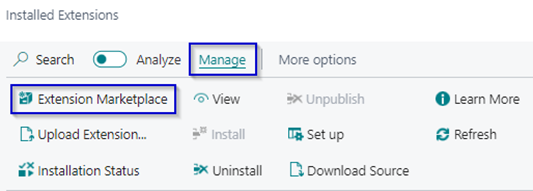

# Manual Extended Documents

Do you want additional information on you Purchase, sales and jobs documents, with this extension you can make this possible by creating addition text in HTML that is shown on these documents.

##### Key Features
*	Add text in HTML on documents
*	Add additional information on an item which is used on documents.

## Install and activate the app
The following procedure shows how to install the extension through the Extension Management page.
1.	Choose the Search icon, Enter Extension Management, and the choose the related link. 
2.	Choose from the menu the Extension Marketplace action.

3.	In the AppSource Apps for Business Central search for **Extended Documents**.
4.	Select the App. 
5.	Select Get It Now. 
6.	Choose from the menu the Deployment Status action. 
7.	Check if the status is Complete.

[:arrow_left:](../README.md) [Back](../README.md)